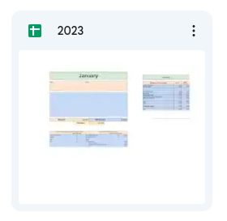
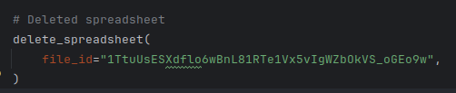
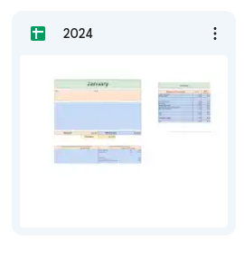

## [Introduction](#table-of-content)

This is the third project for Code Institute.

- This is a simple terminal emulator to talk to Google Spreadsheets
- This emulator will be used to update the sheet for day-to-day expenses of my financials
- It uses the current year to create the spreadsheet
- Coping data from a template spreadsheet

- All credentials that you might or might not see in this project
- Are only for demonstration purposes, as such have been discarded since the creation of this project

---

# Table of Content

- [Introduction](#introduction)
- [Project setup](#project-setup)
  - [Setting up this project locally](#setting-up-this-project-locally)
    - [Setting up python on your local machine](#setting-up-python-on-your-local-machine)
    - [git cloning this project locally](#git-cloning-this-project-locally)
    - [Setting up a Google Service account](#setting-up-a-google-service-account)
  - [Setting up this project on Heroku](#setting-up-this-project-on-heroku)
- [Planning](#planning)
  - [Technology Used](#technology-used)
  - [Flow Chart Diagram](#flow-chart-diagram)
- [User Stories and features](#user-stories-and-features)
  - [User Stories](#user-stories)
  - [Features](#features)
- [Testing](#testing)
  - [Delete old spreadsheet file when creating a new spreadsheet](#delete-old-spreadsheet-file-when-creating-a-new-spreadsheet)
  - [Tested that it correctly creates a spreadsheet based on year](#tested-that-it-correctly-creates-a-spreadsheet-based-on-year)
- [Plans for the future of this project](#plans-for-the-future-of-this-project)
  - [Add a total tab](#add-a-total-tab)
  - [Debit order calculations](#debit-orders-calculations)
  - [Spreadsheet and terminal need to be interchangeable](#spreadsheet-and-terminal-need-to-be-interchangeable)
- [Credits](#credits)

---

## [Project setup](#table-of-content)

### Setting up this project locally

#### Setting up python on your local machine
- If you are a Linux user such as myself
- I used Python 3.12.0 for this project as seen in the runtime.txt file
- If you want to install Python 3.12.0 for this project on Linux, follow this [link](https://www.howtogeek.com/install-latest-python-version-on-ubuntu/)
- Method 1 should work
- If you are a window user, follow this [link](https://www.python.org/downloads/release/python-3120/)
- As I am a Linux user, I will show you how I did it on a Linux machine
- In the home directory on your system, there should be a hidden file called .bashrc
- This file is normally used to load certain commands when the terminal starts
- Set an alias in the .bashrc file for running python files
- alias py='python3.12'
- Now whenever you need to run a python file with python version 3.12
- type "py" followed by the file that you want to run
- py run.py

#### git cloning this project locally
- if using ssh, run the following command
- git clone git@github.com:douglas86/finance-data.git
- if using http, run the following command
- git clone https://github.com/douglas86/finance-data.git
- now that this program is local, you can run the following command
- py run.py

#### Setting up a Google Service account
- This [link](https://docs.gspread.org/en/latest/oauth2.html) will show you how to set up a basic Google service account
- Once the json file has been downloaded to your local machine, save it as creds.json at the root of your project
- Create a .env file for storing environment variables locally
- Place the following variables in your .env file: FOLDER_ID and FILE_ID
- FOLDER_ID: This is the folder where all the spreadsheets get placed, make sure to share it with your service account
- FILE_ID: This is the id of the template spreadsheet file
- Both the Folder_id and File_id can be received in the url of the address bar
- The env file should look something like this

Folder ID can be found after the forward slash, after the word folders

File ID can be found after the d and forward slash

Sharing of folders can be found next to the Folder name there will be an arrow with options

You should see a screen that looks something like this.

### Setting up this project on Heroku
- Create a file called runtime.txt, this tells heroku what version of python you want to use
- Head on over to heroku.com or just type heroku into Google it should be the first one that pops up
- Login to heroku
- On the heroku dashboard, click the button that says new then click new app
- Give your app a name bear in mind that names have to be unique across the entire heroku organisation
- Choose a region
- Once the app has been created, go to the settings tab to add the environment variables
- In the config vars section, click on the button that says reveal config vars
- Add CREDS as the key and all the code in the json file as the value
- Do the same with folder id and file id
- Adding the same credentials that you use in the .env file
- Add a PORT variable with 8000 as its value
- Add the following buildpacks for your app: heroku/python, heroku/nodejs
- Make sure that the buildpacks are in the correct order with python being first
- Go to the Deploy tab at the top
- Under deployment method connect your GitHub repo
- Once you are successfully connected
- Scroll down until you get manual deploy as we want to see how the app looks
- Choose a branch to deploy normally I choose the main branch then click deploy
- Wait a few minutes for it to finish, once it has finished and build successfully, then click view
- With any luck it should be up and running on heroku

---

## [Planning](#table-of-content)

### [Technology Used](#table-of-content)
- I used Python version 3.12.0 for this project
- Intellij IDE for development
- Heroku for deployment
- google developer console for getting the correct credentials for communicating with Google servers
- gspread pip package for communicating with my spreadsheet
- libreoffice draw for designing the flow chart diagram

### [Flow Chart Diagram](#table-of-content)

Flow chart can be seen here as a [PDF](assets/pdf%20documents/Finanace2.odg) document

---

## [User Stories and Features](#table-of-content)

### [User Stories](#table-of-content)

- Create a spreadsheet that I can use to better handle my day-to-day expenses
- Copies the balances over into the new spreadsheet from template 
- All basic expenses get subtracted from my main Monzo account
- My salary gets paid into Barclays then transferred based on a percentage to my Monzo account
- Created space to take on three loans—be it borrowing from other people or taking a loan out at a bank
- Created space for two pension funds as you don't ever need more than that

### [Features](#table-of-content)

- All expenses are shown on a Pie chart when they occur with the percentage
- The new spreadsheet is always created from the template spreadsheet
- It is created with the title of the current year

- I have created a section for reserve/payback
- It becomes a reserve when I want to see how long the money in that account will last me
- This is based on a 3-month withdrawal from that account
- Pension funds are based on a 3-months of daily expenses
- For when I retire one day, I want to see how long my money will last at the average that I am spending
- The second opening that I left for a pension fund under reserve will always be at zero as the one above will take
  both pension funds into account as it works on the balance of both
- Loans are based on a 3-month deposit as I want to see how long it will take until the loan is paid back

---

## [Testing](#table-of-content)

### [Delete old spreadsheet file when creating a new spreadsheet](#table-of-content)

- Whenever I am testing if the new spreadsheet copies the correct data
- I have to delete the old one first
- I have created a separate function in a test.py file called delete_spreadsheet
- I only have to pass in the id number

This image shows how the function looks place this in the run.py file when you need it

You can find the file id from the address bar

### [Tested that it correctly creates a spreadsheet based on year](#table-of-content)

- To test if is correctly creates a spreadsheet based on year
- I can change the current_year variable in settings.py
- I changed that variable to 2024

---

## [Plans for the future of this project](#table-of-content)

### [Add a total tab](#table-of-content)

- I am wanting to add a total tab at the end of december
- This total tab will be used to automatically calculate all the totals in withdrawals and deposit

### [Debit orders calculations](#table-of-content)

- When the spreadsheet is created initially from the template spreadsheet
- It creates a copy updating all debit orders at the start of the year
- What I would like to do as a future update is when the debit order stops at a certain time that year
- Say march, then in april that debit order is deleted, the template gets updated and re-ordered and updated again 
  in april month

### [Spreadsheet and terminal need to be interchangeable](#table-of-content)

- When the template gets updated, it needs to check if all data has changed
- At this point, it is only basing everything on the template
- As soon as data is entered in the terminal it updates the template at the same time
- As a plan, I would like it to get all data from last year to make sure it is all up to date

---

## [Credits](#table-of-content)

- [Luke Buchanan](https://www.linkedin.com/in/lukebuchanan67/) - Mentor
- Rory Patrick Sheridan - Stand in Mentor
- [Code Institute](https://codeinstitute.net/) - Bootcamp
- How to [sort a list in order](https://www.geeksforgeeks.org/python-sort-list-according-second-element-sublist/) based on the second value in that list

---
